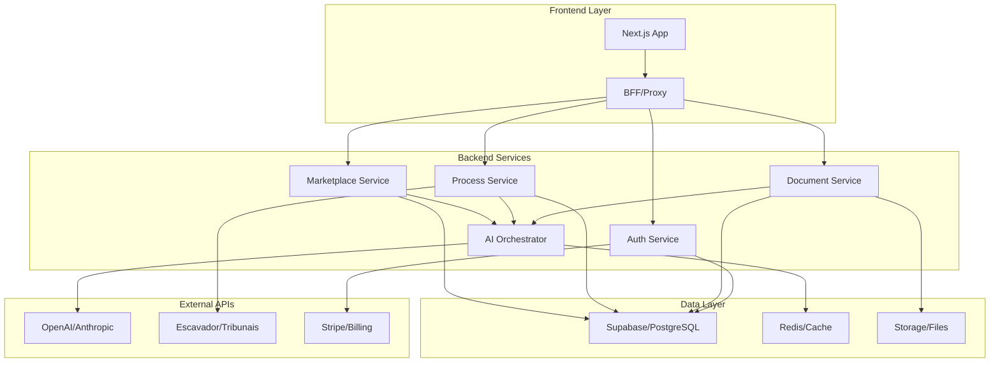

# 🚀 PLANO MASTER DE EVOLUÇÃO - FREELAW AI STUDIO

**Data:** 06/01/2025  
**Versão:** 1.0  
**Status:** Aprovado para Execução  
**Prazo:** 16 semanas (4 meses)

---

## 🎯 VISÃO EXECUTIVA

### O que somos hoje
Uma plataforma jurídica funcional com:
- ✅ Frontend Next.js completo (28/28 testes passando)
- ✅ Funcionalidades core implementadas (chat IA, petições, processos, publicações)
- ✅ Infraestrutura Supabase configurada
- ⚠️ APIs ainda em Next.js (limitação para escala)
- ⚠️ Integrações mockadas (Escavador, tribunais, Stripe)

### O que vamos nos tornar
**O primeiro AI Legal Software completo do Brasil** que combina:
- 🤖 **IA Jurídica Avançada**: Geração, revisão e otimização de documentos
- 👥 **Marketplace Híbrido**: IA + Advogados externos para máxima flexibilidade  
- 📊 **Gestão Inteligente**: Processos, prazos, publicações e CRM automatizados
- 💰 **Modelo de Negócio Escalável**: Assinatura + marketplace + usage-based

---

## 📚 APRENDIZADOS DO LEGADO

### ✅ O que funcionou (manter)
- **Arquitetura clara**: Controller → Service → Repository
- **Avaliação por IA**: Triagem automática de prestadores e matching inteligente
- **APIs REST documentadas**: OpenAPI/Swagger para contratos claros
- **Separação de responsabilidades**: DTOs, validação, error handling

### ❌ O que não funcionou (evitar)
- **Regras acopladas**: Lógica de negócio espalhada nos controllers
- **IA síncrona**: Chamadas de IA bloqueando rotas críticas
- **Falta de eventos**: Orquestração manual sem auditoria
- **Monólito rígido**: Dificuldade para escalar módulos independentemente

### 🎓 Lições aplicáveis
1. **Prestadores**: Reutilizar fluxo de aplicação + avaliação + dashboard
2. **IA como serviço**: Extrair para camada independente com fallbacks
3. **Contratos**: OpenAPI first para todas as integrações
4. **Observabilidade**: Métricas de custo, latência e qualidade desde o início

---

## 🏗️ NOVA ARQUITETURA (HÍBRIDA)



### Componentes principais

#### 1. **Frontend (Next.js) - UI/UX Layer**
- **Responsabilidade**: Interface, SSR, SEO, PWA
- **Tecnologias**: Next.js 15, TypeScript, Tailwind, shadcn/ui
- **Comunicação**: SDK TypeScript gerado via OpenAPI
- **Mantém**: Todas as páginas atuais, componentes UI, testes Playwright

#### 2. **Backend Services (Node.js) - Business Logic**
- **Framework**: NestJS (padrões enterprise, decorators, DI)
- **Arquitetura**: Modular por domínio (documents, processes, marketplace)
- **Padrões**: Repository, Service, Events, CQRS para operações complexas
- **APIs**: OpenAPI 3.0 first, versionamento, rate limiting

#### 3. **AI Orchestrator - Intelligence Layer**
- **Multi-provider**: OpenAI, Anthropic, Groq com routing inteligente
- **Async processing**: Filas para operações longas (análise, geração)
- **Cost optimization**: Modelo mais barato para tarefas simples
- **Quality assurance**: Validação e feedback loop

#### 4. **Event System - Coordination**
- **Message Bus**: Redis + BullMQ para eventos assíncronos
- **Domain Events**: `document.uploaded`, `process.deadline.approaching`
- **Saga Pattern**: Orquestração de fluxos complexos
- **Auditoria**: Log completo de todas as operações

---

## 📋 ROADMAP DETALHADO

### 🏃‍♂️ **FASE 1: FUNDAÇÕES (Semanas 1-4)**

#### Semana 1-2: Backend Setup
```bash
✅ Criar backend NestJS com estrutura modular
✅ Configurar OpenAPI 3.0 + Swagger UI
✅ Implementar autenticação JWT (Supabase)
✅ Setup Redis + BullMQ para filas
✅ Migrar módulo Providers (aproveitar legado)
```

#### Semana 3-4: Event System + AI Layer
```bash
✅ Implementar sistema de eventos
✅ Criar AI Orchestrator multi-provider
✅ Setup observabilidade (logs, métricas, tracing)
✅ Gerar SDK TypeScript para o frontend
✅ Migrar upload de documentos com processamento assíncrono
```

**Entrega**: Backend funcional com Providers + Documents, SDK gerado

---

### 🎯 **FASE 2: CORE BUSINESS (Semanas 5-8)**

#### Semana 5-6: Integrações Críticas
```bash
✅ Integração Escavador (busca processos, publicações)
✅ Cálculo automático de prazos processuais
✅ Sistema de notificações (email, push, SMS)
✅ Migrar gestão de processos
```

#### Semana 7-8: IA Jurídica Avançada
```bash
✅ Pipeline de geração de petições com IA
✅ Análise de documentos (classificação, extração)
✅ Sistema de revisão e sugestões
✅ Office Style com personalização por IA
```

**Entrega**: Produto jurídico completo com IA funcional

---

### 🤝 **FASE 3: MARKETPLACE (Semanas 9-12)**

#### Semana 9-10: Prestadores 2.0
```bash
✅ Onboarding completo (aplicação, teste, aprovação)
✅ Sistema de avaliação por IA (aproveitar legado)
✅ Dashboard de prestadores com gamificação
✅ Matching algorithm inteligente
```

#### Semana 11-12: Delegação Inteligente
```bash
✅ Orquestração IA ↔ Humano
✅ Sistema de chat integrado
✅ Controle de qualidade e SLA
✅ Precificação dinâmica
```

**Entrega**: Marketplace híbrido funcional

---

### 💰 **FASE 4: MONETIZAÇÃO (Semanas 13-16)**

#### Semana 13-14: Billing & Payments
```bash
✅ Integração Stripe completa
✅ Planos de assinatura (Starter, Pro, Enterprise)
✅ Usage metering (tokens IA, documentos, delegações)
✅ Portal de billing para clientes
```

#### Semana 15-16: Analytics & Otimização
```bash
✅ Dashboard executivo com métricas de negócio
✅ A/B testing para conversão
✅ Otimização de custos de IA
✅ Preparação para escala (caching, CDN)
```

**Entrega**: Produto completo pronto para crescimento

---

## 🎯 MODELO DE NEGÓCIO OTIMIZADO

### Planos de Assinatura

#### 🥉 **Starter** - R$ 299/mês
- 50 documentos IA/mês
- 3 processos ativos
- Chat básico com IA
- Suporte por email

#### 🥈 **Professional** - R$ 699/mês  
- 200 documentos IA/mês
- 15 processos ativos
- Marketplace de prestadores
- Integrações tribunais
- Suporte prioritário

#### 🥇 **Enterprise** - R$ 1.499/mês
- Documentos ilimitados
- Processos ilimitados  
- IA personalizada (fine-tuning)
- API access
- Success manager

### Revenue Streams Adicionais
- **Marketplace**: 15% de comissão sobre delegações
- **Usage overage**: R$ 2 por documento extra
- **Integrações premium**: R$ 199/mês por tribunal
- **White label**: Negociação customizada

---

## 📊 MÉTRICAS DE SUCESSO

### Produto
- **Time to Value**: < 24h para primeira petição gerada
- **AI Accuracy**: > 85% de aprovação sem revisão
- **User Engagement**: > 20 sessões/mês por usuário ativo
- **Document Velocity**: < 5min para geração de petição padrão

### Negócio
- **MRR Growth**: 20% ao mês
- **Churn Rate**: < 5% mensal
- **ARPU**: R$ 800+ médio
- **CAC Payback**: < 6 meses

### Técnico
- **API Latency**: < 200ms (p95)
- **Uptime**: > 99.9%
- **AI Cost/Document**: < R$ 0,50
- **Error Rate**: < 0.1%

---

## 🛡️ RISCOS E MITIGAÇÕES

### Riscos Técnicos
- **Dependência de IA externa**: Multi-provider + fallbacks
- **Latência em picos**: Auto-scaling + cache inteligente
- **Dados sensíveis**: Criptografia, RLS, auditoria completa

### Riscos de Negócio  
- **Adoção lenta**: Programa de early adopters + onboarding assistido
- **Concorrência**: Foco em diferenciação (IA + marketplace híbrido)
- **Regulamentação**: Compliance OAB + privacy by design

### Riscos Operacionais
- **Escalabilidade**: Arquitetura cloud-native desde início
- **Qualidade**: Testes automatizados + monitoring proativo
- **Equipe**: Documentação técnica + knowledge sharing

---

## 🚀 PRÓXIMOS PASSOS IMEDIATOS

### Esta Semana (06-12 Jan)
1. **Setup inicial do backend NestJS**
2. **Configurar OpenAPI 3.0 + Swagger**  
3. **Implementar autenticação JWT**
4. **Migrar módulo Providers**

### Próxima Semana (13-19 Jan)
1. **Sistema de eventos com Redis**
2. **AI Orchestrator multi-provider**
3. **Gerar SDK TypeScript**
4. **Migrar upload de documentos**

### Mês 1 (Jan 2025)
- Backend funcional com 2 módulos migrados
- Frontend consumindo via SDK
- IA assíncrona funcionando
- Observabilidade básica

---

## 🎉 VISÃO DE FUTURO

**Em 4 meses teremos:**
- A plataforma jurídica com IA mais avançada do Brasil
- Marketplace híbrido único no mercado
- Base de clientes pagantes recorrentes  
- Arquitetura preparada para escalar 10x

**Em 1 ano poderemos:**
- Expandir para outros países (LATAM)
- Lançar produtos verticais (imobiliário, trabalhista)
- IPO ou aquisição estratégica
- Transformar o mercado jurídico brasileiro

---

*"O futuro da advocacia é híbrido: IA para eficiência, humanos para estratégia, tecnologia para escala."*

**Vamos construir o futuro juntos! 🚀**

